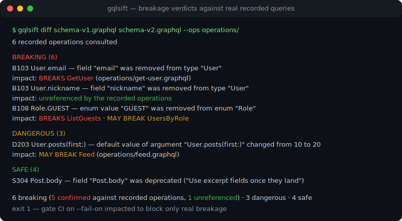
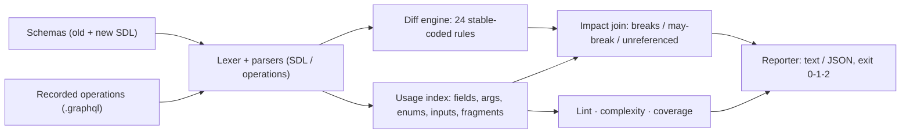

# gqlsift

[English](README.md) | [中文](README.zh.md) | [日本語](README.ja.md)

[](LICENSE)   [](CONTRIBUTING.md)

**オープンソースで依存ゼロの GraphQL スキーマ diff ＆オペレーション linter——実際に記録されたクエリに対する破壊判定、複雑度スコア、未使用フィールドレポートを 1 つのオフライン CLI で。**



```bash
# not yet on npm — install from a checkout of this repository
npm install && npm run build && npm pack
npm install -g ./gqlsift-0.1.0.tgz
```

## なぜ gqlsift？

GraphQL はクライアントを音もなく壊します。サーバーがスキーマ変更をデプロイしても、クライアント側のクエリはすべてパースされ続け、最初の異常は本番環境の 3 画面奥で起きる null クラッシュ——レビューのどの段階でも「`User.email` を削除した」と「アカウント画面がそれをクエリしている」が結び付かなかったからです。スキーマ diff ツールは既にありますが、その多くは変更そのものの分類で止まります：*breaking* か *safe* か、文脈抜きの判定です。リリースゲートが本当に必要とする問いは別にあります：**この変更は、誰かが実際に送っているクエリを壊すのか？** gqlsift は契約の両側を突き合わせて答えます——2 つの SDL ファイルを安定コード付きの変更リスト（breaking 13、dangerous 4、safe 7 のルール）へ diff し、記録済みオペレーション（persisted queries、クライアントの `.graphql` ファイル、ゲートウェイのキャプチャ）を旧スキーマで走査して、各変更にオペレーション単位の判定を刻印します：`breaks GetUser`、`may-break CreatePost`（値が実行時に変数経由で届く）、あるいは `unreferenced`——`--fail-on impacted` の下では出荷可能。同じオペレーション走査器が 13 ルールのオペレーション linter、決定的な複雑度スコア、未使用フィールドレポートも駆動し、依存なしのバイナリ 1 つでスキーマライフサイクルのチェックリスト全体を賄います。

|  | gqlsift | graphql-inspector | Apollo Rover | GraphQL Hive CLI |
|---|---|---|---|---|
| 破壊的変更の分類 | 安定コード付き 24 ルール | あり | registry チェック経由 | あり |
| 記録済みオペレーションへの判定 | オペレーション単位の `breaks` / `may-break` / `unreferenced` | 利用状況の把握はサービスエンドポイントが必要 | Apollo Studio のトラフィックが必要 | Hive registry が必要 |
| 完全オフライン動作 | はい——ファイル 2 つとクエリのディレクトリだけ | 部分的 | いいえ（registry） | いいえ（registry） |
| オペレーション lint | 修正提案付き 13 ルール | validate コマンド | なし | なし |
| 複雑度スコア / 未使用フィールド | 内蔵、CI ゲート可能 | なし / なし | なし / Studio 経由 | なし / registry 経由 |
| アカウントやサービスの要否 | 不要 | 不要 | Apollo Studio | Hive |
| ランタイム依存 | 0 | ~15 | コンパイル済み・自己完結 | ~40 |

<sub>機能と依存数は各プロジェクトの公開ドキュメントと npm メタデータで確認、2026-07。</sub>

## 特徴

- **分類だけでなく破壊判定** —— breaking / dangerous な各変更を記録済みオペレーションと突き合わせ：立証できれば `breaks`、決め手の値が変数経由なら `may-break`、誰もクエリしていなければ `unreferenced`。
- **本当に有効化できる CI ゲート** —— `--fail-on impacted` は実在の記録済みオペレーションが命中したときだけビルドを落とすので、スキーマ掃除が「breaking だが死んでいる」フィールドに阻まれなくなります。厳格な現場には `breaking`、`dangerous`、`never` ポリシーも。
- **安定コード付き 24 の diff ルール** —— B1xx/D2xx/S3xx コードは API であり決して振り直されません。null 許容の方向は位置ごとに判定（出力の厳格化は安全、入力の厳格化は破壊）し、型削除はフィールドノイズへ連鎖しません。
- **本物のオペレーション linter** —— 未知のフィールド/引数/enum 値には最近傍名の提案、必須引数の欠落、fragment を貫通する変数の宣言・使用追跡、fragment 到達性、リーフ/複合の選択形状：13 ルール、エラーと警告を峻別。
- **決定的な複雑度スコア** —— 深さ、フィールド数、そして重み付きコスト：無制限リストは `--list-factor` を乗算し、リテラルの `first`/`last`/`limit` 引数が乗数を抑えます。`--max-depth`/`--max-cost` でゲート。
- **ランタイム依存ゼロ、完全オフライン** —— 必要なのは Node.js だけ。GraphQL レキサー、2 つのパーサー、全解析がリポジトリ内実装で、ツールはソケットを一切開きません。

## クイックスタート

`diff` に旧スキーマ、新スキーマ、記録済みオペレーションを渡します：

```bash
gqlsift diff examples/schema-v1.graphql examples/schema-v2.graphql --ops examples/operations
```

出力（実際のキャプチャ、breaking セクションを表示）：

```text
gqlsift diff: examples/schema-v1.graphql -> examples/schema-v2.graphql
6 recorded operations consulted

BREAKING (6)
  B104 Comment.text — field "Comment.text" changed type from "String!" to "String"
       impact: BREAKS Feed (examples/operations/feed.graphql), Search (examples/operations/search.graphql)
  B112 CreatePostInput.authorId — required input field "authorId: ID!" was added to input type "CreatePostInput"
       impact: MAY BREAK CreatePost (examples/operations/create-post.graphql)
  B105 Query.search(scope:) — required argument "scope: SearchScope!" was added to field "Query.search"
       impact: BREAKS Search (examples/operations/search.graphql)
  B108 Role.GUEST — enum value "GUEST" was removed from enum "Role"
       impact: BREAKS ListGuests (examples/operations/list-guests.graphql) · MAY BREAK UsersByRole (examples/operations/users-by-role.graphql)
  B103 User.email — field "email" was removed from type "User"
       impact: BREAKS GetUser (examples/operations/get-user.graphql)
  B103 User.nickname — field "nickname" was removed from type "User"
       impact: unreferenced by the recorded operations

...

6 breaking (5 confirmed against recorded operations, 1 unreferenced) · 3 dangerous · 4 safe
```

終了コード 1——あるいは `--fail-on impacted` を付ければ、残る破壊がすべて未参照になった時点で通過します。同じドリフトをオペレーション側から見ると（実際のキャプチャ）：

```bash
gqlsift lint --schema examples/schema-v2.graphql examples/operations
```

```text
examples/operations/create-post.graphql
  line 6  warning L407  field "Post.body" is deprecated: Use excerpt fields once they land

examples/operations/get-user.graphql
  line 6  error L401  unknown field "email" on type "User"

examples/operations/list-guests.graphql
  line 3  error L413  argument "role": "GUEST" is not a value of enum "Role"

examples/operations/search.graphql
  line 3  error L403  missing required argument "scope" on field "Query.search"

6 files linted · 3 errors · 1 warning
```

`gqlsift score` と `gqlsift coverage` が残りを埋めます：同梱の `Feed` クエリはコスト 6661（`--max-cost 1000` でフラグ）、coverage は未使用フィールド 10 件に加え、非推奨なのに使われ続ける `Post.body` を報告します。完全なウォークスルーは [examples/](examples/README.md) に。

## 変更コードと判定

深刻度：**breaking**（適合クライアントが動かなくなる）、**dangerous**（既存クライアントの下で挙動が変わる）、**safe**（純粋な追加）。コードは安定 API。ルールごとの根拠を含む完全なカタログは [docs/change-catalog.md](docs/change-catalog.md) に。

| 範囲 | 数 | 対象 |
|---|---|---|
| B101–B113 | 13 | 型/フィールド/引数/enum 値/union メンバー/input フィールドの削除、kind 変更、非互換な型変更、新規必須引数と input フィールド |
| D201–D204 | 4 | enum 値と union メンバーの追加（網羅的マッチ勢）、引数・input フィールドのデフォルト値の変更/追加/削除 |
| S301–S307 | 7 | 各種追加、非推奨状態の遷移、互換方向の null 許容変更 |
| L401–L413 | 13 | オペレーション lint：未知の名前（提案付き）、必須引数、変数、fragment、選択形状、enum リテラル |

## CLI リファレンス

`diff <old> <new>` はスキーマを比較。`lint`、`score`、`coverage` は `--schema <file>` とオペレーションパス（ファイルまたはディレクトリ、`*.graphql`/`*.gql` を再帰走査）を取ります。全サブコマンドが `--format text|json` を受け付けます。

| フラグ | 既定 | 効果 |
|---|---|---|
| `--ops <path>`（diff、複数可） | なし | 影響評価に使う記録済みオペレーション |
| `--fail-on breaking\|dangerous\|impacted\|never` | `breaking` | 終了コード 1 のポリシー。`impacted` は記録済みオペレーション命中時のみ失敗 |
| `--strict`（lint） | オフ | 警告でも失敗させる |
| `--max-depth`、`--max-cost`（score） | オフ | オペレーション単位の複雑度ゲート |
| `--list-factor <n>`（score） | `10` | 無制限リストフィールドの乗数 |
| `--min <pct>`（coverage） | オフ | フィールドカバレッジが閾値未満なら失敗 |

終了コード：`0` クリーン、`1` ポリシーに基づく検出あり、`2` 用法/パース/IO エラー——スクリプトはゲートの失敗と呼び出しの壊れを区別できます。

## アーキテクチャ



## ロードマップ

- [x] 安定コード付き 24 ルールのスキーマ diff、オペレーション単位の破壊判定、`--fail-on` CI ポリシー、13 ルールのオペレーション linter、複雑度スコア、未使用フィールド coverage、JSON 出力（v0.1.0）
- [ ] diff 前の型拡張（`extend`）マージ
- [ ] `lint` での変数-引数の型互換性と fragment 適用可能性チェック
- [ ] persisted-query マニフェストとゲートウェイ JSON ログからのオペレーション取り込み
- [ ] `diff --explain <code>`：ルールのカタログ項目と修正方法をその場で表示

完全なリストは [open issues](https://github.com/JaydenCJ/gqlsift/issues) を参照。

## コントリビュート

コントリビュート歓迎。`npm install && npm run build` でビルドし、`npm test`（92 テスト）と `bash scripts/smoke.sh`（`SMOKE OK` を出力すること）を実行してください——このリポジトリは CI を同梱せず、上記の主張はすべてローカル実行で検証されています。[CONTRIBUTING.md](CONTRIBUTING.md) を読み、[good first issue](https://github.com/JaydenCJ/gqlsift/issues?q=is%3Aissue+is%3Aopen+label%3A%22good+first+issue%22) を掴むか、[discussion](https://github.com/JaydenCJ/gqlsift/discussions) を始めてください。

## ライセンス

[MIT](LICENSE)
