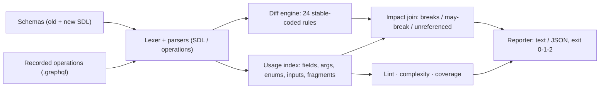

# gqlsift

[English](README.md) | [中文](README.zh.md) | [日本語](README.ja.md)

[](LICENSE)   [](CONTRIBUTING.md)

**An open-source, zero-dependency GraphQL schema diff and operation linter — breakage verdicts against real recorded queries, complexity scores and unused-field reports in one offline CLI.**


```bash
# not yet on npm — install from a checkout of this repository
npm install && npm run build && npm pack
npm install -g ./gqlsift-0.1.0.tgz
```

## Why gqlsift?

GraphQL breaks clients silently. The server deploys a schema edit, every query keeps parsing on the client side, and the first failure is a production null-crash three screens deep — because nothing in review connected "we removed `User.email`" to "the account screen queries it". Schema-diff tools exist, but most stop at classifying the change itself: *breaking* or *safe*, judged in a vacuum. The question a release gate actually needs answered is different: **does this change break a query someone really sends?** gqlsift answers it by joining both sides of the contract — it diffs two SDL files into a stable-coded change list (13 breaking, 4 dangerous, 7 safe rules), then walks your recorded operations (persisted queries, client `.graphql` files, gateway captures) against the old schema and stamps every change with a per-operation verdict: `breaks GetUser`, `may-break CreatePost` (the value arrives via a variable at runtime), or `unreferenced` — safe to ship under `--fail-on impacted`. The same operation walker powers a 13-rule operation linter, deterministic complexity scores and an unused-field report, so one dependency-free binary covers the whole schema-lifecycle checklist.

|  | gqlsift | graphql-inspector | Apollo Rover | GraphQL Hive CLI |
|---|---|---|---|---|
| Breaking-change classification | 24 stable-coded rules | yes | via registry checks | yes |
| Verdicts against recorded operations | per-operation `breaks` / `may-break` / `unreferenced` | usage-aware only with a service endpoint | requires Apollo Studio traffic | requires Hive registry |
| Works fully offline | yes — two files + a directory of queries | partially | no (registry) | no (registry) |
| Operation linting | 13 rules with fix suggestions | validate command | no | no |
| Complexity scores / unused fields | built in, CI-gateable | no / no | no / via Studio | no / via registry |
| Account or service required | none | none | Apollo Studio | Hive |
| Runtime dependencies | 0 | ~15 | compiled, self-contained | ~40 |

<sub>Capability and dependency counts checked against each project's public docs and npm metadata, 2026-07.</sub>

## Features

- **Breakage verdicts, not just classifications** — every breaking or dangerous change is joined against your recorded operations: `breaks` when provable, `may-break` when the deciding value flows through a variable, `unreferenced` when nobody queries it.
- **A CI gate you can actually turn on** — `--fail-on impacted` fails the build only when a real recorded operation is hit, so schema cleanup stops being blocked by breaking-but-dead fields; `breaking`, `dangerous` and `never` policies cover stricter shops.
- **24 diff rules with stable codes** — B1xx/D2xx/S3xx codes are API and never renumbered; nullability direction is judged per position (tightening an output is safe, tightening an input breaks), and removed types do not cascade into field noise.
- **A real operation linter** — unknown fields/arguments/enum values with nearest-name suggestions, missing required arguments, variable declaration/usage traced through fragments, fragment reachability, leaf/composite selection shape: 13 rules, errors distinct from warnings.
- **Deterministic complexity scores** — depth, field count and a weighted cost where unbounded lists multiply by `--list-factor` and literal `first`/`last`/`limit` arguments bound the multiplier; gate with `--max-depth`/`--max-cost`.
- **Zero runtime dependencies, fully offline** — Node.js is the only requirement; the GraphQL lexer, both parsers, and every analysis are in-repo, and the tool never opens a socket.

## Quickstart

Point `diff` at the old schema, the new schema, and your recorded operations:

```bash
gqlsift diff examples/schema-v1.graphql examples/schema-v2.graphql --ops examples/operations
```

Output (real captured run, showing the breaking section):

```text
gqlsift diff: examples/schema-v1.graphql -> examples/schema-v2.graphql
6 recorded operations consulted

BREAKING (6)
  B104 Comment.text — field "Comment.text" changed type from "String!" to "String"
       impact: BREAKS Feed (examples/operations/feed.graphql), Search (examples/operations/search.graphql)
  B112 CreatePostInput.authorId — required input field "authorId: ID!" was added to input type "CreatePostInput"
       impact: MAY BREAK CreatePost (examples/operations/create-post.graphql)
  B105 Query.search(scope:) — required argument "scope: SearchScope!" was added to field "Query.search"
       impact: BREAKS Search (examples/operations/search.graphql)
  B108 Role.GUEST — enum value "GUEST" was removed from enum "Role"
       impact: BREAKS ListGuests (examples/operations/list-guests.graphql) · MAY BREAK UsersByRole (examples/operations/users-by-role.graphql)
  B103 User.email — field "email" was removed from type "User"
       impact: BREAKS GetUser (examples/operations/get-user.graphql)
  B103 User.nickname — field "nickname" was removed from type "User"
       impact: unreferenced by the recorded operations

...

6 breaking (5 confirmed against recorded operations, 1 unreferenced) · 3 dangerous · 4 safe
```

Exit code 1 — or run with `--fail-on impacted` to pass once the only remaining breakage is unreferenced. The same drift, seen from the operations' side (real captured run):

```bash
gqlsift lint --schema examples/schema-v2.graphql examples/operations
```

```text
examples/operations/create-post.graphql
  line 6  warning L407  field "Post.body" is deprecated: Use excerpt fields once they land

examples/operations/get-user.graphql
  line 6  error L401  unknown field "email" on type "User"

examples/operations/list-guests.graphql
  line 3  error L413  argument "role": "GUEST" is not a value of enum "Role"

examples/operations/search.graphql
  line 3  error L403  missing required argument "scope" on field "Query.search"

6 files linted · 3 errors · 1 warning
```

`gqlsift score` and `gqlsift coverage` complete the set: the bundled `Feed` query weighs in at cost 6661 (flagged by `--max-cost 1000`), and coverage reports 10 unused fields plus `Post.body` as deprecated-but-still-used. The full walkthrough lives in [examples/](examples/README.md).

## Change codes and verdicts

Severities: **breaking** (a conforming client stops working), **dangerous** (behavior shifts under existing clients), **safe** (purely additive). Codes are stable API; the full catalog with per-rule reasoning is in [docs/change-catalog.md](docs/change-catalog.md).

| Range | Count | Covers |
|---|---|---|
| B101–B113 | 13 | removed types/fields/arguments/enum values/union members/input fields, kind changes, incompatible type changes, newly required arguments and input fields |
| D201–D204 | 4 | enum values and union members added (exhaustive matchers), argument and input-field defaults changed/gained/lost |
| S301–S307 | 7 | additions, deprecation transitions, and the compatible nullability direction |
| L401–L413 | 13 | operation lint: unknown names (with suggestions), required arguments, variables, fragments, selection shape, enum literals |

## CLI reference

`diff <old> <new>` compares schemas; `lint`, `score` and `coverage` take `--schema <file>` plus operation paths (files or directories, scanned recursively for `*.graphql`/`*.gql`). Every subcommand accepts `--format text|json`.

| Flag | Default | Effect |
|---|---|---|
| `--ops <path>` (diff, repeatable) | none | recorded operations to assess impact against |
| `--fail-on breaking\|dangerous\|impacted\|never` | `breaking` | exit-1 policy; `impacted` fails only when a recorded operation is hit |
| `--strict` (lint) | off | warnings also fail the run |
| `--max-depth`, `--max-cost` (score) | off | complexity gates per operation |
| `--list-factor <n>` (score) | `10` | multiplier for unbounded list fields |
| `--min <pct>` (coverage) | off | fail when field coverage drops below the threshold |

Exit codes: `0` clean, `1` findings per policy, `2` usage/parse/IO error — so scripts can tell a failing gate from a broken invocation.

## Architecture



## Roadmap

- [x] Schema diff with 24 stable-coded rules, per-operation breakage verdicts, `--fail-on` CI policies, 13-rule operation linter, complexity scores, unused-field coverage, JSON output (v0.1.0)
- [ ] Type extension (`extend`) merging before diffing
- [ ] Variable-vs-argument type compatibility and fragment applicability checks in `lint`
- [ ] Operation ingestion from persisted-query manifests and gateway JSON logs
- [ ] `diff --explain <code>`: print the catalog entry and remediation for a rule inline

See the [open issues](https://github.com/JaydenCJ/gqlsift/issues) for the full list.

## Contributing

Contributions are welcome. Build with `npm install && npm run build`, then run `npm test` (92 tests) and `bash scripts/smoke.sh` (must print `SMOKE OK`) — this repository ships no CI, every claim above is verified by local runs. See [CONTRIBUTING.md](CONTRIBUTING.md), grab a [good first issue](https://github.com/JaydenCJ/gqlsift/issues?q=is%3Aissue+is%3Aopen+label%3A%22good+first+issue%22), or start a [discussion](https://github.com/JaydenCJ/gqlsift/discussions).

## License

[MIT](LICENSE)
