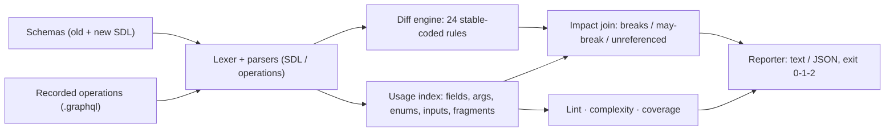

# gqlsift

[English](README.md) | [中文](README.zh.md) | [日本語](README.ja.md)

[](LICENSE)   [](CONTRIBUTING.md)

**开源、零依赖的 GraphQL schema diff 与操作 linter——用真实录制的查询给出破坏性裁决，外加复杂度评分与未使用字段报告，一个离线 CLI 全部搞定。**


```bash
# not yet on npm — install from a checkout of this repository
npm install && npm run build && npm pack
npm install -g ./gqlsift-0.1.0.tgz
```

## 为什么选 gqlsift？

GraphQL 弄坏客户端时悄无声息。服务端部署了一次 schema 修改，客户端的每条查询照旧能解析，第一个报错却是生产环境里三层页面之下的空指针崩溃——因为评审中没有任何环节把"我们删掉了 `User.email`"和"账户页正在查询它"联系起来。schema diff 工具早已存在，但大多数止步于给变更本身分类：*breaking* 还是 *safe*，凭空判断。而发布闸门真正需要回答的问题是另一个：**这次变更会不会弄坏某条真的有人在发的查询？** gqlsift 通过把契约的两侧连起来作答——它先把两份 SDL 文件 diff 成带稳定编码的变更清单（13 条 breaking、4 条 dangerous、7 条 safe 规则），再用旧 schema 遍历你录制的操作（persisted queries、客户端 `.graphql` 文件、网关抓取），给每条变更盖上逐操作的裁决：`breaks GetUser`、`may-break CreatePost`（值在运行时经由变量传入），或 `unreferenced`——在 `--fail-on impacted` 下可以放行。同一套操作遍历器还驱动着 13 条规则的操作 linter、确定性的复杂度评分和未使用字段报告，一个无依赖的二进制覆盖 schema 生命周期的整张清单。

|  | gqlsift | graphql-inspector | Apollo Rover | GraphQL Hive CLI |
|---|---|---|---|---|
| 破坏性变更分类 | 24 条稳定编码规则 | 有 | 经由 registry 检查 | 有 |
| 针对录制操作的裁决 | 逐操作 `breaks` / `may-break` / `unreferenced` | 需要服务端点才有用量感知 | 需要 Apollo Studio 流量 | 需要 Hive registry |
| 完全离线可用 | 是——两个文件加一个查询目录 | 部分 | 否（registry） | 否（registry） |
| 操作 lint | 13 条规则，附修复建议 | validate 命令 | 无 | 无 |
| 复杂度评分 / 未使用字段 | 内置，可做 CI 闸门 | 无 / 无 | 无 / 经由 Studio | 无 / 经由 registry |
| 是否需要账号或服务 | 不需要 | 不需要 | Apollo Studio | Hive |
| 运行时依赖 | 0 | ~15 | 编译产物，自包含 | ~40 |

<sub>能力与依赖数量对照各项目公开文档及 npm 元数据核对，2026-07。</sub>

## 功能特性

- **破坏性裁决，而不只是分类** —— 每条 breaking 或 dangerous 变更都会与你录制的操作做连接：可证实时给 `breaks`，决定性取值经由变量传入时给 `may-break`，无人查询时给 `unreferenced`。
- **真正敢打开的 CI 闸门** —— `--fail-on impacted` 只在真实录制操作被命中时才让构建失败，schema 清理不再被"breaking 但已死"的字段卡住；`breaking`、`dangerous` 与 `never` 策略覆盖更严格的团队。
- **24 条带稳定编码的 diff 规则** —— B1xx/D2xx/S3xx 编码是 API，永不重编号；可空性方向按位置判断（收紧输出安全，收紧输入破坏），删除类型不会级联成字段噪音。
- **一个货真价实的操作 linter** —— 未知字段/参数/枚举值附最近名字建议、缺失的必填参数、变量声明与使用穿透 fragment 追踪、fragment 可达性、叶子/复合选择形状：13 条规则，错误与警告分明。
- **确定性的复杂度评分** —— 深度、字段数，以及加权成本：无界列表乘以 `--list-factor`，字面量 `first`/`last`/`limit` 参数则约束乘数；用 `--max-depth`/`--max-cost` 设闸。
- **零运行时依赖，完全离线** —— 只需要 Node.js；GraphQL 词法器、两个解析器和全部分析都在仓库内实现，工具从不打开任何套接字。

## 快速上手

把 `diff` 指向旧 schema、新 schema 和你录制的操作：

```bash
gqlsift diff examples/schema-v1.graphql examples/schema-v2.graphql --ops examples/operations
```

输出（真实捕获运行，展示 breaking 段）：

```text
gqlsift diff: examples/schema-v1.graphql -> examples/schema-v2.graphql
6 recorded operations consulted

BREAKING (6)
  B104 Comment.text — field "Comment.text" changed type from "String!" to "String"
       impact: BREAKS Feed (examples/operations/feed.graphql), Search (examples/operations/search.graphql)
  B112 CreatePostInput.authorId — required input field "authorId: ID!" was added to input type "CreatePostInput"
       impact: MAY BREAK CreatePost (examples/operations/create-post.graphql)
  B105 Query.search(scope:) — required argument "scope: SearchScope!" was added to field "Query.search"
       impact: BREAKS Search (examples/operations/search.graphql)
  B108 Role.GUEST — enum value "GUEST" was removed from enum "Role"
       impact: BREAKS ListGuests (examples/operations/list-guests.graphql) · MAY BREAK UsersByRole (examples/operations/users-by-role.graphql)
  B103 User.email — field "email" was removed from type "User"
       impact: BREAKS GetUser (examples/operations/get-user.graphql)
  B103 User.nickname — field "nickname" was removed from type "User"
       impact: unreferenced by the recorded operations

...

6 breaking (5 confirmed against recorded operations, 1 unreferenced) · 3 dangerous · 4 safe
```

退出码 1——或者带 `--fail-on impacted` 运行，当仅剩的破坏都无人引用时即可放行。同一份漂移，从操作侧看（真实捕获运行）：

```bash
gqlsift lint --schema examples/schema-v2.graphql examples/operations
```

```text
examples/operations/create-post.graphql
  line 6  warning L407  field "Post.body" is deprecated: Use excerpt fields once they land

examples/operations/get-user.graphql
  line 6  error L401  unknown field "email" on type "User"

examples/operations/list-guests.graphql
  line 3  error L413  argument "role": "GUEST" is not a value of enum "Role"

examples/operations/search.graphql
  line 3  error L403  missing required argument "scope" on field "Query.search"

6 files linted · 3 errors · 1 warning
```

`gqlsift score` 与 `gqlsift coverage` 补齐全套：自带的 `Feed` 查询成本高达 6661（被 `--max-cost 1000` 标记），coverage 报告 10 个未使用字段，外加 `Post.body` 已弃用却仍被使用。完整演练见 [examples/](examples/README.md)。

## 变更编码与裁决

严重级别：**breaking**（合规客户端停止工作）、**dangerous**（现有客户端下行为发生偏移）、**safe**（纯增量）。编码是稳定 API；含逐规则理由的完整目录见 [docs/change-catalog.md](docs/change-catalog.md)。

| 区段 | 数量 | 覆盖 |
|---|---|---|
| B101–B113 | 13 | 删除的类型/字段/参数/枚举值/union 成员/input 字段、kind 变更、不兼容类型变更、新增必填参数与 input 字段 |
| D201–D204 | 4 | 新增枚举值与 union 成员（穷举匹配者）、参数与 input 字段默认值的变更/新增/移除 |
| S301–S307 | 7 | 各类新增、弃用状态迁移，以及兼容方向的可空性变更 |
| L401–L413 | 13 | 操作 lint：未知名字（附建议）、必填参数、变量、fragment、选择形状、枚举字面量 |

## CLI 参考

`diff <old> <new>` 比较 schema；`lint`、`score`、`coverage` 接受 `--schema <file>` 加操作路径（文件或目录，递归扫描 `*.graphql`/`*.gql`）。所有子命令都接受 `--format text|json`。

| 选项 | 默认 | 作用 |
|---|---|---|
| `--ops <path>`（diff，可重复） | 无 | 用于评估影响的录制操作 |
| `--fail-on breaking\|dangerous\|impacted\|never` | `breaking` | 退出码 1 的策略；`impacted` 仅在录制操作被命中时失败 |
| `--strict`（lint） | 关 | 警告也使运行失败 |
| `--max-depth`、`--max-cost`（score） | 关 | 逐操作的复杂度闸门 |
| `--list-factor <n>`（score） | `10` | 无界列表字段的乘数 |
| `--min <pct>`（coverage） | 关 | 字段覆盖率低于阈值时失败 |

退出码：`0` 干净，`1` 按策略有发现，`2` 用法/解析/IO 错误——脚本因此能分清闸门失败与调用出错。

## 架构



## 路线图

- [x] 24 条稳定编码规则的 schema diff、逐操作破坏裁决、`--fail-on` CI 策略、13 条规则的操作 linter、复杂度评分、未使用字段 coverage、JSON 输出（v0.1.0）
- [ ] diff 之前合并类型扩展（`extend`）
- [ ] `lint` 中的变量-参数类型兼容性与 fragment 适用性检查
- [ ] 从 persisted-query 清单与网关 JSON 日志摄取操作
- [ ] `diff --explain <code>`：就地打印某条规则的目录条目与修复方法

完整清单见 [open issues](https://github.com/JaydenCJ/gqlsift/issues)。

## 参与贡献

欢迎贡献。用 `npm install && npm run build` 构建，然后运行 `npm test`（92 个测试）和 `bash scripts/smoke.sh`（必须打印 `SMOKE OK`）——本仓库不附带 CI，以上每一条主张都由本地运行验证。参见 [CONTRIBUTING.md](CONTRIBUTING.md)，认领一个 [good first issue](https://github.com/JaydenCJ/gqlsift/issues?q=is%3Aissue+is%3Aopen+label%3A%22good+first+issue%22)，或发起 [discussion](https://github.com/JaydenCJ/gqlsift/discussions)。

## 许可证

[MIT](LICENSE)
